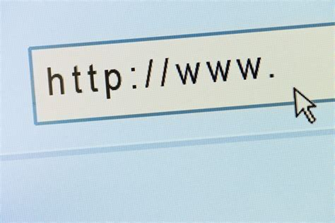

## Belangrijke punten:

- Uniform Resource Locator
- Bestaat uit protocol, 
- Domeinnaam, Subdomein, pad en queryparameters

---
## Enkele belangrijke punten:

- Protocol: specificeert communicatieregels (bijv. HTTP of HTTPS)
- Domeinnaam: naamgevingssysteem waarmee diensten en toepassingen kunnen ïdentificeerd

---

## Enkele belangrijke punten:

- Pad: Het pad geeft de locatie van een specifieke bron op de server aan.
- Querystring: De querystring wordt gebruikt om parameters aan de URL toe te voegen.

---

## Enkele belangrijke punten:

- Subdomein: een optioneel voorvoegsel voor het hoofddomein en wordt gevolgd door een punt.
- Top Level Domain (TLD): het laatste gedeelte van het domein, zoals ".com", ".org", ".net", enzovoort.

---

## Enkele belangrijke punten:

- Fragment (Anchor): Het fragment verwijst naar een specifiek gedeelte van de bron die wordt weergegeven.

---

## Voorbeelden

Hier zijn enkele voorbeelden van URL's:

- Website: https://www.example.com (HTTPS)
- API-eindpunt: http://api.example.com/users?id=123
- Lokaal bestand: file:///C:/Users/username/file.txt

---

## Conclusie

URL's zijn essentieel voor het web. Ze geven toegang tot bronnen en delen informatie. Begrijpen en correct gebruiken is belangrijk voor webontwikkeling en navigatie.
